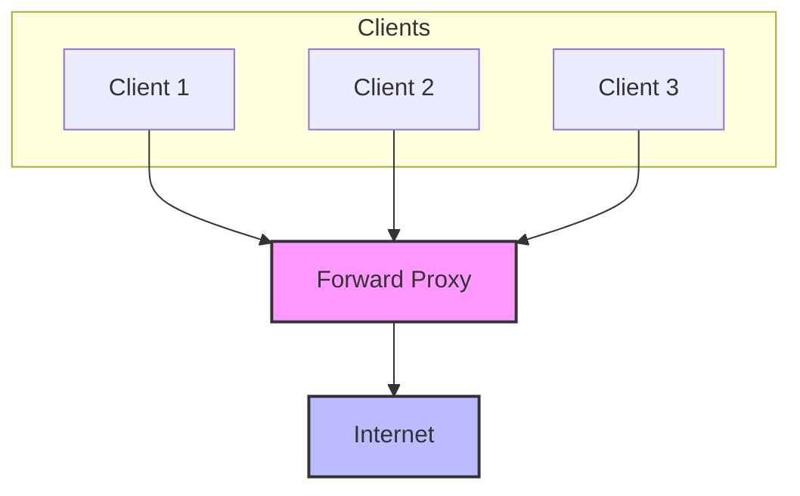
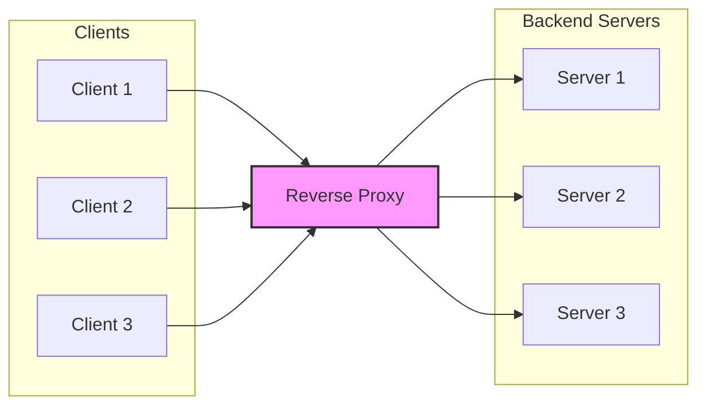

## What is a Proxy Server?
A proxy server acts as an intermediary between users and the internet or between different network services. However, there are two main types of proxy servers that serve different purposes: forward proxies and reverse proxies.

## Forward Proxy
A forward proxy, commonly known as just a "proxy," sits between client devices and the internet.

In this setup, all clients route their traffic through the forward proxy to reach the internet. The proxy acts as a centralized point for managing outbound traffic.

### Key Characteristics:
- Acts on behalf of clients (users)
- Helps clients access resources they might not be able to directly
- Client is aware of the proxy's existence
- Often used to bypass geo-restrictions or maintain anonymity

### Common Use Cases:
- Bypassing geographical restrictions
- Anonymous browsing
- Content filtering in corporate networks
- Caching frequently accessed content

## Reverse Proxy
A reverse proxy sits in front of web servers and forwards client requests to those servers.

In this configuration, clients connect to what appears to be a single server (the reverse proxy), which then distributes requests across multiple backend servers transparently.

### Key Characteristics:
- Acts on behalf of servers
- Clients are typically unaware of the backend servers
- Provides additional security by hiding server details
- Can distribute load among multiple servers

### Common Use Cases:
- Load balancing
- SSL termination
- Caching static content
- Protection against DDoS attacks
- API Gateway implementations

## Key Differences

| Feature | Forward Proxy | Reverse Proxy |
|---------|--------------|---------------|
| Position | In front of clients | In front of servers |
| Purpose | Helps clients access external resources | Helps servers handle incoming requests |
| Visibility | Client knows proxy, server doesn't | Server knows proxy, client doesn't |
| Configuration | Client must be configured | No client configuration needed |
| Common Uses | Privacy, content filtering | Load balancing, security |

## When to Use Which?

### Use Forward Proxy When:
- You need to control or monitor outbound traffic
- Users need to bypass geographical restrictions
- You want to implement content filtering
- Privacy and anonymity are priorities

### Use Reverse Proxy When:
- You need to load balance between multiple servers
- You want to add SSL/TLS encryption
- You need to cache content for better performance
- You want to protect backend servers from direct exposure

## Conclusion
While both types of proxies act as intermediaries, they serve different purposes. Forward proxies help protect client privacy and control access, while reverse proxies help protect and optimize server operations. Understanding these differences is crucial for implementing the right solution for your specific needs. 